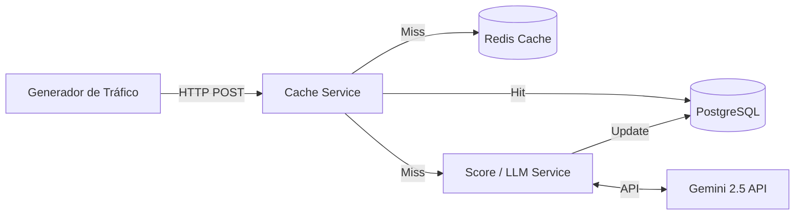

# Plataforma de Análisis de Preguntas (Yahoo! Answers)

Este proyecto implementa una plataforma distribuida para el análisis de preguntas y respuestas utilizando un Large Language Model (LLM). Forma parte de la evaluación de la asignatura Sistemas Distribuidos, simulando un entorno donde consultas históricas de Yahoo! Answers son respondidas por un modelo de Inteligencia Artificial (Gemini) y cacheadas para optimizar el rendimiento bajo carga.

## Arquitectura del Sistema

La arquitectura está diseñada bajo principios de microservicios, asegurando modularidad, escalabilidad y la fácil integración de nuevos componentes.



### Componentes Principales

1. **Generador de Tráfico (Go)**: Simula solicitudes de usuarios hacia el sistema. Puede generar tráfico bajo distribuciones Constante, de Poisson (eventos independientes) o de Zipf (simulación realista donde pocas preguntas concentran el mayor número de visitas).
2. **Cache Service (FastAPI)**: Actúa como un proxy inverso. Recibe las consultas del generador de tráfico, busca en Redis y, si no encuentra la respuesta (miss), delega al Score Service.
3. **Score & LLM Service (FastAPI)**: Servicio encargado de interactuar con el modelo LLM (Gemini 2.5 Flash). Extrae la mejor respuesta original de la base de datos, obtiene una nueva respuesta del LLM y calcula métricas de calidad (Similitud del Coseno y ROUGE-L).
4. **Almacenamiento (PostgreSQL)**: Base de datos relacional que persiste las preguntas, las respuestas originales, las respuestas del LLM, los scores calculados y un contador de accesos.
5. **Caché (Redis)**: Almacenamiento en memoria ultrarrápido para optimizar las respuestas repetitivas. Soporta múltiples políticas de evicción (LRU, LFU, etc.).

## Requisitos Previos

- Docker y Docker Compose instalados.
- Un API Key de Google Gemini (si deseas probar el LLM real, aunque el sistema soporta un modo "Mock" por defecto).

## Configuración y Ejecución

1. **Variables de Entorno**: El proyecto utiliza un archivo `.env` centralizado. Copia el archivo de ejemplo:
   ```bash
   cp .env.example .env
   ```
   *Nota: Por defecto, `MOCK_LLM=True` está activado para evitar consumir cuota de la API de Gemini durante las pruebas locales.*

2. **Levantar Infraestructura y Servicios**:
   Ejecuta el siguiente comando para levantar todos los servicios en segundo plano:
   ```bash
   docker compose up -d
   ```

3. **Población de la Base de Datos (Seed)**:
   La primera vez que ejecutes el proyecto, debes cargar el dataset en PostgreSQL:
   ```bash
   docker compose --profile seed up seed
   ```

## Ejecución de Experimentos

El proyecto incluye un script automatizado para ejecutar las combinaciones de distribuciones de tráfico y políticas de caché (LRU, LFU) y diferentes tamaños de memoria.

1. Otorgar permisos de ejecución al script:
   ```bash
   chmod +x scripts/run_experiments.sh
   ```

2. Ejecutar los experimentos:
   ```bash
   cd scripts && ./run_experiments.sh
   ```

3. **Análisis y Gráficos**:
   Una vez completados los experimentos, genera las visualizaciones (requiere entorno de Python local con matplotlib y psycopg2):
   ```bash
   python scripts/analyze_results.py
   ```
   Los resultados y gráficos se guardarán en el directorio `results/`.

## Métricas y Análisis Implementado

El sistema evalúa la calidad de las respuestas del LLM utilizando dos métricas complementarias:
- **Similitud del Coseno (all-MiniLM-L6-v2)**: Evalúa la equivalencia semántica profunda.
- **ROUGE-L**: Mide la subsecuencia común más larga, evaluando la similitud léxica.

Además, el sistema de caché recopila estadísticas detalladas (Hit Rate, Latencias, Misses) accesibles en tiempo real mediante `GET http://localhost:8000/metrics`.
